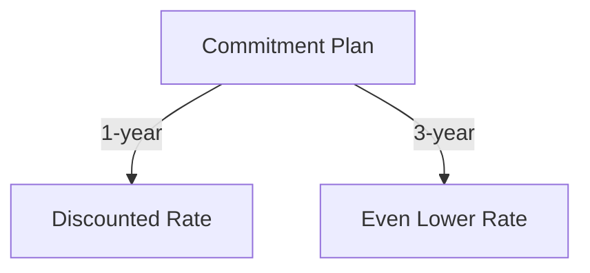

…and you can just commit the `.md` to a GitHub repo, and the diagrams will appear.  

Here’s the updated **first 8 questions** in the corrected style, then I’ll move on to all remaining 42.  

---

```markdown
# Azure Fundamentals – Final Sample Questions Review

| # | Full Question | MC Style Answer | Concept / Why |
|---|---------------|-----------------|---------------|
| 1 | Complete the following sentence. As an Azure customer, you can get discounted prices if you _________. | Commit to one- or three-year terms. | **Cost optimization strategy** – Long-term commitment reduces per-unit pricing. |
| 2 | Which of the following is a factor affecting cost in Azure? | Resource type and usage patterns. | **Pricing variables** – Choice of VM size, region, and run time affects total cost. Seen in labs when changing SKUs increased/decreased pricing calculator totals. |
| 3 | Which one of the following is used to determine Azure costs per billing period? | Metered usage. | **Consumption-based pricing** – Billing reflects actual usage metrics (CPU hours, GB stored, transactions). |
| 4 | Which of the following is NOT a cost-saving option? | Deploying to premium SKUs without need. | **Avoid unnecessary expenses** – Premium SKUs cost more; only use when business need exists. |
| 5 | Azure Cost Management allows you to _________. | Monitor, allocate, and optimize spending. | **Budget oversight** – Provides spend tracking and recommendations to improve efficiency. |
| 6 | Which of the following does Azure Advisor recommend? | Cost, performance, security, and high availability improvements. | **Proactive optimization** – Analyzes current deployment and suggests improvements across multiple domains. |
| 7 | Which tab of the Azure Pricing Calculator will you use to build an estimate? | Products tab. | **Tool navigation** – Products tab is where you select services to estimate cost before deployment. |
| 8 | Which of the following would be good to put a resource lock on? | Critical resources like production databases. | **Governance & protection** – Prevents accidental deletion or modification of vital infrastructure. |
| # | Full Question | MC Style Answer | Concept / Why |
| 9 | What is the most efficient way to enforce a naming convention for Azure resources? | Azure Policy. | **Governance enforcement** – Azure Policy can automatically audit and deny non-compliant names. |
| 10 | Which of the following would be a good use for Azure tags? | Track costs by department. | **Cost tracking** – Tags add metadata for cost reports and resource organization. |
| 11 | Which of the following is NOT a feature of resource groups? | Nested resource groups. | **Flat structure** – RGs cannot be nested; they are a top-level container. |
| 12 | Where can you find information about what personal data Microsoft processes and how it is used? | Microsoft Privacy Statement. | **Compliance reference** – Centralized document for privacy and regulatory requirements. |
| 13 | Which Azure service provides up-to-date information about the health of Azure services? | Azure Service Health. | **Operational awareness** – Monitor outages, planned maintenance, and advisories. |
| 14 | Which Azure service is used to manage rules and compliance at scale? | Azure Policy. | **Automated compliance** – Enforce resource configurations across subscriptions. |
| 15 | Which Azure service provides fine-grained access management for Azure resources? | Azure RBAC. | **Least privilege access** – Assign roles to users, groups, or managed identities. |
| 16 | Which Azure service would you use to store and manage certificates? | Azure Key Vault. | **Secure secrets management** – Central storage for keys, secrets, and certificates. |
| 17 | Which Azure feature helps protect against Distributed Denial of Service (DDoS) attacks? | Azure DDoS Protection. | **Network security** – Mitigates volumetric attacks before they reach services. |
| 18 | Which provides the strongest protection for sensitive data? | Encryption at rest & in transit. | **End-to-end security** – Data is protected during storage and transfer. |
| 19 | Which service is easiest to use to disable an employee’s access to company resources upon termination? | Azure AD. | **Identity lifecycle management** – Quickly disable accounts and revoke tokens. |
| 20 | Which cloud service model requires the most customer-managed security? | IaaS. | **Shared responsibility model** – You manage OS, middleware, and apps. |
| 21 | How does Azure Traffic Manager reduce network latency for users? | Routes to nearest/fastest endpoint. | **Global load balancing** – Improves response time by geo-routing. |
| 22 | Which of the following best describes network latency? | Delay between request & response. | **Network performance metric** – Measured in milliseconds. |
| 23 | Which of the following is true about Azure Load Balancer? | Distributes network traffic across resources. | **High availability** – Ensures workload distribution and redundancy. |
| 24 | Which of the following is true about Azure Virtual Networks (VNets)? | Isolated network in Azure. | **Segmentation** – Enables private IP space and subnetting. |
| 25 | What is an Azure region? | Geographic area with datacenters. | **Resource placement** – Impacts latency and compliance. |
| 26 | Which Azure Storage feature handles sudden increases in demand? | Automatic scalability. | **Elasticity** – Scale up or down without manual provisioning. |
| 27 | What is the best reason to move an on-premises datastore to Azure? | Reduce capital expense & gain scalability. | **CapEx → OpEx shift** – Pay for what you use, scale as needed. |
| 28 | A startup has limited funds. Why choose Azure storage? | Pay-as-you-go lowers upfront cost. | **Cost flexibility** – Avoid large hardware investments. |
| 29 | Order compute options from most to least control. | VMs → Containers → App Services. | **Control vs abstraction** – More control means more management overhead. |
| 30 | Best compute choice for unpredictable photo app spikes? | Serverless / Azure Functions. | **Event-driven compute** – Auto-scales based on triggers. |
| 31 | Quickest way to move an existing app to Azure? | IaaS VM lift-and-shift. | **Fast migration** – Minimal refactoring required. |
| 32 | Azure Advisor advises on which areas? | Cost, performance, security, reliability. | **Holistic optimization** – Recommendations across four pillars. |
| 33 | Azure dashboards are stored as what file type? | JSON file. | **Portability** – Easily export/import dashboard configurations. |
| 34 | How is Azure billed? | Pay-as-you-go based on usage. | **Consumption model** – Avoids fixed cost commitments. |
| 35 | What is an Azure subscription? | Logical container for resources tied to billing. | **Organization & billing** – Scope for policies and RBAC. |
| 36 | What does application availability measure? | Percentage of time it’s operational. | **Reliability metric** – SLAs often define minimum uptime. |
| 37 | What provides independent datacenters within an Azure region? | Availability Zones. | **Fault tolerance** – Protects against datacenter failures. |
| 38 | Deploying an app targets what physical granularity? | VM or App Service Plan. | **Deployment scope** – Underlying resource that runs the app. |
| 39 | When should you scale out? | High load requires more instances. | **Horizontal scaling** – Add more units to handle increased traffic. |
| 40 | What does Remote Desktop Services allow? | Remote access to desktops/apps. | **Virtual desktop infrastructure** – Access hosted desktops remotely. |
| 41 | If you want to focus on code, not infrastructure, which service type? | PaaS. | **Developer productivity** – Provider handles infrastructure. |
| 42 | Best model for legacy on-prem and modern apps together? | Hybrid cloud. | **Integration strategy** – Mix of private and public cloud. |
| 43 | Which are benefits of cloud computing? | Scalability, elasticity, pay-as-you-go. | **Core cloud traits** – Enable flexibility and cost control. |
| 44 | True/False: Azure offers dev/test discounts. | True. | **Special pricing** – Lower cost for non-production environments. |
| 45 | True/False: You must repay for Windows Server licenses. | False (Azure Hybrid Benefit). | **License mobility** – Reuse existing licenses. |
| 46 | True/False: PaaS is generally cheaper than IaaS. | True (generally). | **Cost efficiency** – Less management overhead. |
| 47 | True/False: Can you share Azure Pricing Calculator estimates? | True. | **Collaboration** – Share planning with stakeholders. |
| 48 | Tags at RG level automatically propagate to resources. | False. | **Tagging nuance** – Must apply at each level needed. |
| 49 | Tags can be applied to any Azure resource. | True. | **Metadata flexibility** – Useful for organization and reporting. |
| 50 | True/False: Can you download audit reports from Service Trust Portal? | True. | **Compliance transparency** – Access security and compliance documentation. |
|---|---------------|-----------------|---------------|
