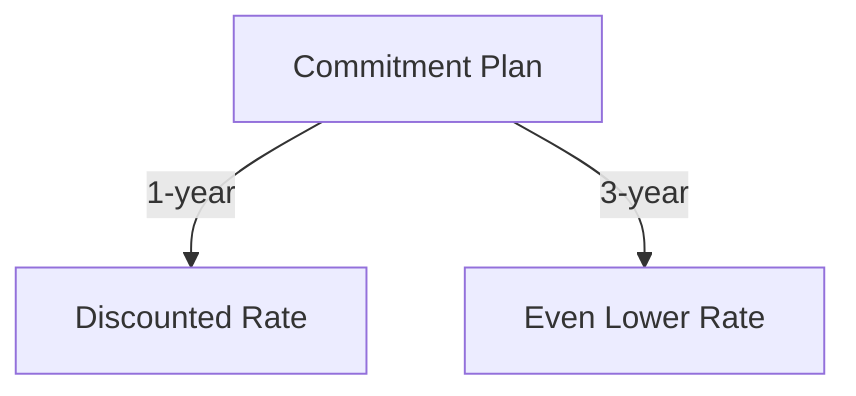
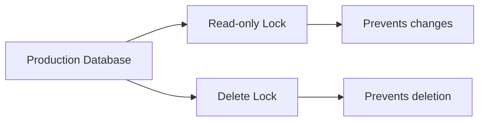
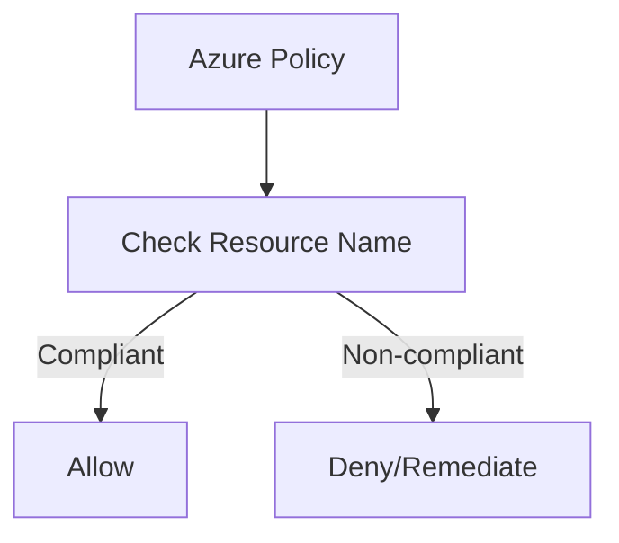
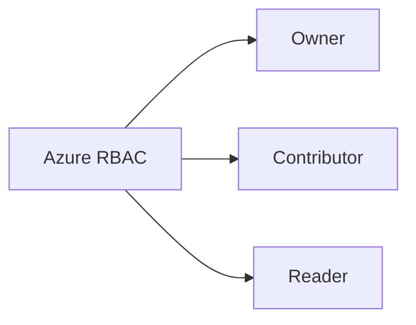
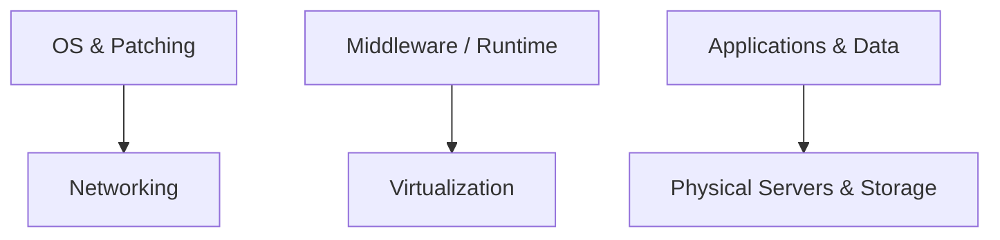
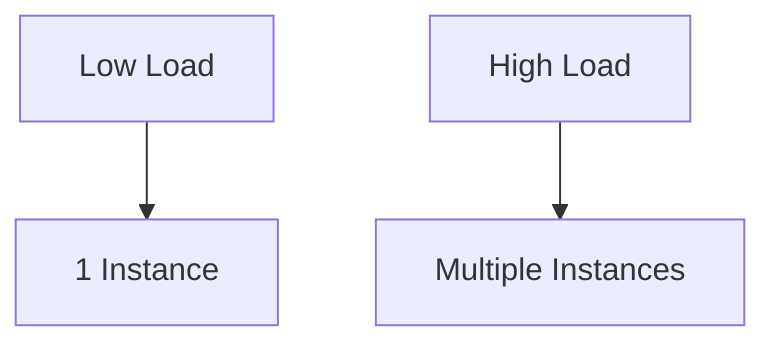

# Azure Fundamentals – Final Sample Questions Review

## A. Q → MC-Style Answer → Concept/Why

> Note: Cells are kept short for quick scan (no long sentences).

| # | Full Question | MC Style Answer | Concept / Why |
|---|---|---|---|
| 1 | Complete the following sentence. As an Azure customer, Azure Reservations offer discounted prices if you _________. | Commit to one- or three-year terms. | Cost optimization (commit & save) |
| 2 | Which of the following is a factor affecting costs? | Resource type and usage patterns. | Pricing variables (SKU, runtime) |
| 3 | Which one of the following is used to determine Azure costs for each billing period? | Metered usage. | Consumption billing model |
| 4 | Which one of these is not a cost-saving solution? | Using premium SKUs without need. | Avoid over-provisioning |
| 5 | Azure Cost Management allows you to _________. | Monitor, allocate, and optimize spend. | Budgeting & cost control |
| 6 | Azure Advisor provides recommendations for _________. | Cost, performance, security, reliability. | Proactive best-practice tips |
| 7 | Which tab of the Azure pricing calculator will you use to put together your estimate? | **Products** tab. | Build estimate inputs |
| 8 | Which of the following would be good to put a resource lock on? | Critical prod resources (e.g., DB). | Prevent accidental delete/change |
| 9 | Which is the most efficient way to ensure a naming convention is followed across your subscription? | **Azure Policy**. | Governance at scale |
| 10 | Which of the following might be a good usage of tags? | Track costs by department. | Cost allocation metadata |
| 11 | Which of the following is not a feature of resource groups? | Nested resource groups. | RGs are flat containers |
| 12 | Where can you obtain details about the personal data Microsoft processes, how it processes it, and for what purposes? | Microsoft Privacy Statement. | Privacy/compliance reference |
| 13 | Which service provides up-to-date status info about Azure services’ health? | Azure Service Health. | Outage/maintenance visibility |
| 14 | Which Azure service lets you create/assign/manage policies for rules and compliance? | **Azure Policy**. | Config/compliance enforcement |
| 15 | Which Azure service enables fine-grained access for resources (least privilege)? | **Azure RBAC**. | Role-based access control |
| 16 | You want to store certificates centrally for services. Which service? | **Azure Key Vault**. | Secure secrets/certs storage |
| 17 | Your public site was overwhelmed by an attack (resources exhausted). Which service helps prevent this? | **Azure DDoS Protection**. | DDoS mitigation |
| 18 | Which is the strongest way to protect sensitive customer data? | Encryption at rest & in transit. | End-to-end data protection |
| 19 | What helps you most easily disable an account when an employee leaves? | **Azure AD** (Entra ID). | Identity lifecycle |
| 20 | Shared responsibility: which cloud model requires the most customer security effort? | **IaaS**. | You manage OS & above |
| 21 | How does Azure Traffic Manager reduce latency? | Routes users to nearest/fastest endpoint. | Global DNS load balancing |
| 22 | What is network latency? | Delay between request & response. | Network performance metric |
| 23 | Which is true about Azure Load Balancer? | Distributes traffic across instances. | Intra/region load distribution |
| 24 | Which of the following is true about virtual networks? | VNets are isolated private networks. | Segmentation & subnets |
| 25 | What is an Azure region? | Geographic area with datacenters. | Placement, latency, compliance |
| 26 | Celebrity mention causes storage spike. What feature of pay-as-you-go storage helps? | Automatic scalability. | Elastic capacity |
| 27 | Which scenario benefits most from moving on-prem datastore to Azure? | Reduce CapEx, gain scalability. | CapEx→OpEx, scale on demand |
| 28 | Startup, limited funds: why choose Azure storage over on-prem? | Pay-as-you-go lowers upfront cost. | Cost flexibility |
| 29 | Compute options from most→least control? | VMs → Containers → App Services. | Control vs abstraction |
| 30 | Photo app with unpredictable spikes: best compute? | Serverless / Azure Functions. | Event-driven autoscale |
| 31 | Existing app on local server; need quick move to Azure. Best option? | IaaS VM lift-and-shift. | Fast migration |
| 32 | Azure Advisor provides advice on which topics? | Cost, performance, security, reliability. | Full-stack tuning |
| 33 | An Azure dashboard is stored as which type of file? | JSON. | Export/import portability |
| 34 | Billing in Azure is ______________ | Pay-as-you-go by usage. | Consumption billing |
| 35 | Which defines an Azure subscription correctly? | Billing-tied logical resource container. | Org/billing scope |
| 36 | Application availability refers to what? | % of time app is operational. | Reliability/SLA metric |
| 37 | To use datacenters with independent power/cooling/networking in a region, choose _________? | Availability Zones. | Fault domain isolation |
| 38 | Deploying an app can be done directly to what physical granularity? | VM or App Service Plan. | Target runtime |
| 39 | When should you scale out your deployment? | High load → add instances. | Horizontal scaling |
| 40 | What does Remote Desktop Services allow you to do? | Remote access to desktops/apps. | VDI/thin client model |
| 41 | Build/test/deploy without managing hardware/software: best cloud service type? | **PaaS**. | Dev productivity |
| 42 | Legacy mainframe + modern apps: best deployment model? | **Hybrid cloud**. | Mixed environment fit |
| 43 | Which terms are benefits of cloud services? | Scalability, elasticity, pay-as-you-go. | Core cloud value |
| 44 | True or false: Azure has money-saving options for dev/test servers. | **True**. | Special pricing/benefits |
| 45 | True or false: If you already have Windows Server licenses, you must pay again on Azure. | **False** (Azure Hybrid Benefit). | License mobility |
| 46 | True or false: PaaS is generally less expensive than IaaS. | **True** (generally). | Less mgmt overhead |
| 47 | True or false: You can share your estimate via Excel or a URL. | **True**. | Calculator collaboration |
| 48 | Tags applied at a resource group level are propagated to resources within the group. | **False**. | No automatic inheritance |
| 49 | Tags can be applied to any type of resource on Azure. | **True**. | Broad tagging support |
| 50 | True or false: You can download published audit/compliance reports from the Service Trust Portal. | **True**. | Compliance transparency |

---

## B. Supplementary Diagrams (separate from table)

### Q1 – Reservations (commitment → discount)

Q8 – Resource Locks (protect prod resources)

Q9 – Naming Enforcement with Azure Policy

Q15 – RBAC Role Examples

Q20 – Shared Responsibility (IaaS focus)

Q39 – Scale-Out Trigger

