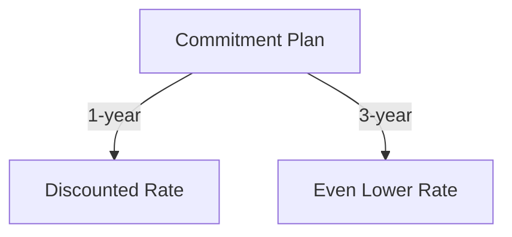
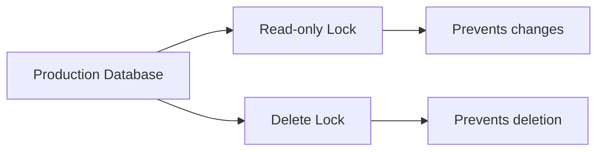
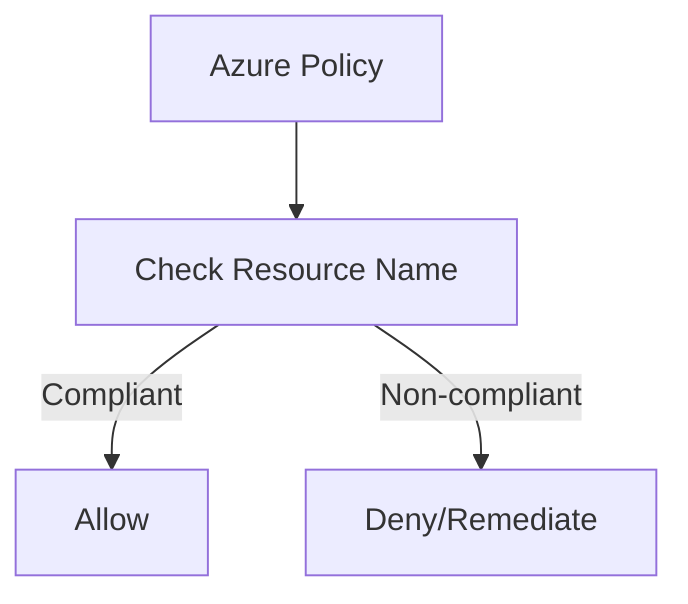
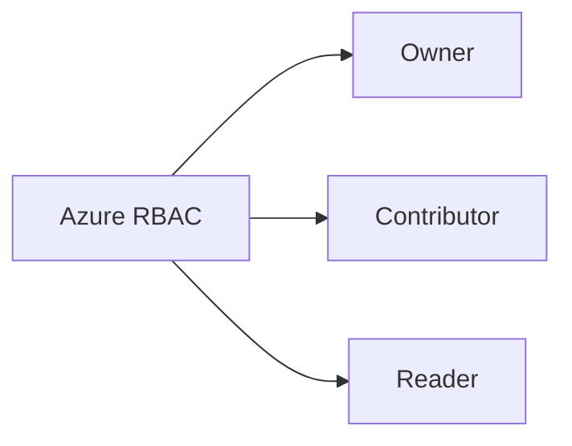
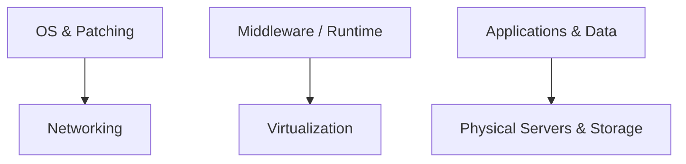
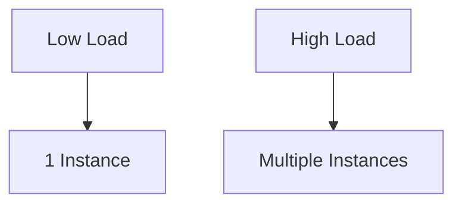

# Azure Fundamentals – Final Sample Questions Review

## A. Q → MC-Style Answer → Concept/Why

> Note: Cells are kept short for quick scan (no long sentences).

| # | Full Question | MC Style Answer | Concept / Why |
|---|---|---|---|
| 1 | Complete the following sentence. As an Azure customer, Azure Reservations offer discounted prices if you _________. | Commit to one- or three-year terms. | Cost optimization (commit & save) |
| 2 | Which of the following is a factor affecting costs? | Resource type and usage patterns. | Pricing variables (SKU, runtime) |
| 3 | Which one of the following is used to determine Azure costs for each billing period? | Metered usage. | Consumption billing model |
| 4 | Which one of these is not a cost-saving solution? | Using premium SKUs without need. | Avoid over-provisioning |
| 5 | Azure Cost Management allows you to _________. | Monitor, allocate, and optimize spend. | Budgeting & cost control |
| 6 | Azure Advisor provides recommendations for _________. | Cost, performance, security, reliability. | Proactive best-practice tips |
| 7 | Which tab of the Azure pricing calculator will you use to put together your estimate? | **Products** tab. | Build estimate inputs |
| 8 | Which of the following would be good to put a resource lock on? | Critical prod resources (e.g., DB). | Prevent accidental delete/change |
| 9 | Which is the most efficient way to ensure a naming convention is followed across your subscription? | **Azure Policy**. | Governance at scale |
| 10 | Which of the following might be a good usage of tags? | Track costs by department. | Cost allocation metadata |
| 11 | Which of the following is not a feature of resource groups? | Nested resource groups. | RGs are flat containers |
| 12 | Where can you obtain details about the personal data Microsoft processes, how it processes it, and for what purposes? | Microsoft Privacy Statement. | Privacy/compliance reference |
| 13 | Which service provides up-to-date status info about Azure services’ health? | Azure Service Health. | Outage/maintenance visibility |
| 14 | Which Azure service lets you create/assign/manage policies for rules and compliance? | **Azure Policy**. | Config/compliance enforcement |
| 15 | Which Azure service enables fine-grained access for resources (least privilege)? | **Azure RBAC**. | Role-based access control |
| 16 | You want to store certificates centrally for services. Which service? | **Azure Key Vault**. | Secure secrets/certs storage |
| 17 | Your public site was overwhelmed by an attack (resources exhausted). Which service helps prevent this? | **Azure DDoS Protection**. | DDoS mitigation |
| 18 | Which is the strongest way to protect sensitive customer data? | Encryption at rest & in transit. | End-to-end data protection |
| 19 | What helps you most easily disable an account when an employee leaves? | **Azure AD** (Entra ID). | Identity lifecycle |
| 20 | Shared responsibility: which cloud model requires the most customer security effort? | **IaaS**. | You manage OS & above |
| 21 | How does Azure Traffic Manager reduce latency? | Routes users to nearest/fastest endpoint. | Global DNS load balancing |
| 22 | What is network latency? | Delay between request & response. | Network performance metric |
| 23 | Which is true about Azure Load Balancer? | Distributes traffic across instances. | Intra/region load distribution |
| 24 | Which of the following is true about virtual networks? | VNets are isolated private networks. | Segmentation & subnets |
| 25 | What is an Azure region? | Geographic area with datacenters. | Placement, latency, compliance |
| 26 | Celebrity mention causes storage spike. What feature of pay-as-you-go storage helps? | Automatic scalability. | Elastic capacity |
| 27 | Which scenario benefits most from moving on-prem datastore to Azure? | Reduce CapEx, gain scalability. | CapEx→OpEx, scale on demand |
| 28 | Startup, limited funds: why choose Azure storage over on-prem? | Pay-as-you-go lowers upfront cost. | Cost flexibility |
| 29 | Compute options from most→least control? | VMs → Containers → App Services. | Control vs abstraction |
| 30 | Photo app with unpredictable spikes: best compute? | Serverless / Azure Functions. | Event-driven autoscale |
| 31 | Existing app on local server; need quick move to Azure. Best option? | IaaS VM lift-and-shift. | Fast migration |
| 32 | Azure Advisor provides advice on which topics? | Cost, performance, security, reliability. | Full-stack tuning |
| 33 | An Azure dashboard is stored as which type of file? | JSON. | Export/import portability |
| 34 | Billing in Azure is ______________ | Pay-as-you-go by usage. | Consumption billing |
| 35 | Which defines an Azure subscription correctly? | Billing-tied logical resource container. | Org/billing scope |
| 36 | Application availability refers to what? | % of time app is operational. | Reliability/SLA metric |
| 37 | To use datacenters with independent power/cooling/networking in a region, choose _________? | Availability Zones. | Fault domain isolation |
| 38 | Deploying an app can be done directly to what physical granularity? | VM or App Service Plan. | Target runtime |
| 39 | When should you scale out your deployment? | High load → add instances. | Horizontal scaling |
| 40 | What does Remote Desktop Services allow you to do? | Remote access to desktops/apps. | VDI/thin client model |
| 41 | Build/test/deploy without managing hardware/software: best cloud service type? | **PaaS**. | Dev productivity |
| 42 | Legacy mainframe + modern apps: best deployment model? | **Hybrid cloud**. | Mixed environment fit |
| 43 | Which terms are benefits of cloud services? | Scalability, elasticity, pay-as-you-go. | Core cloud value |
| 44 | True or false: Azure has money-saving options for dev/test servers. | **True**. | Special pricing/benefits |
| 45 | True or false: If you already have Windows Server licenses, you must pay again on Azure. | **False** (Azure Hybrid Benefit). | License mobility |
| 46 | True or false: PaaS is generally less expensive than IaaS. | **True** (generally). | Less mgmt overhead |
| 47 | True or false: You can share your estimate via Excel or a URL. | **True**. | Calculator collaboration |
| 48 | Tags applied at a resource group level are propagated to resources within the group. | **False**. | No automatic inheritance |
| 49 | Tags can be applied to any type of resource on Azure. | **True**. | Broad tagging support |
| 50 | True or false: You can download published audit/compliance reports from the Service Trust Portal. | **True**. | Compliance transparency |

---

## B. Supplementary Diagrams (separate from table)

### Q1 – Reservations (commitment → discount)

Q8 – Resource Locks (protect prod resources)

Q9 – Naming Enforcement with Azure Policy

Q15 – RBAC Role Examples

Q20 – Shared Responsibility (IaaS focus)

Q39 – Scale-Out Trigger

Final review – Azure fundamentals and related concepts
This review answers the questions from the “Final Sample Questions” file using information from the Azure Fundamentals lectures, the Azure lecture deck and supporting course material. Each question is followed by its answer and an explanation of the underlying concept to help you connect the theory to the practical labs completed during the term.

Cost management and pricing
1 – Azure Reservations
Answer: Azure Reservations (Azure Reserved VM Instances) give discounted prices when you commit to a one‑ or three‑year term of resource usage. By paying for the full term up front or with periodic payments, you lock in lower rates compared with pay‑as‑you‑go pricing. The Azure lecture notes explain that reserved instances are purchased in one‑ or three‑year terms and require payment for the full term. In practice, you would only buy reservations for workloads you know will run continuously for a long period (for example, domain controllers or database servers).

Why it matters: The question tests your understanding of how Azure helps customers reduce costs. Committing to a term allows Microsoft to plan capacity and therefore offer lower prices. As you size workloads during labs, you may notice significant savings from reservations versus pay‑as‑you‑go pricing.

2 – Factors affecting cost
Answer: Several factors affect Azure costs. Important ones include the resource type, services in use, the region where the resource is deployed, inbound/outbound data transfer (ingress/egress) and billing model. The pricing module lists “resource type” and “services” among the primary factors affecting cost

. Each service uses one or more meters that track usage; the quantity of meters and the rate for each meter determine cost. Compute resources are usually charged per hour or per second, storage per GB and outbound data per GB.

Why it matters: Accurately estimating costs requires understanding which factors drive charges. In labs you learned that placing a resource in a different region or using premium storage increases cost. Awareness of these factors helps you select the most cost‑effective configuration.

3 – Determining costs for each billing period
Answer: Azure uses meters to track consumption. Each service and resource is associated with one or more meters that measure usage (for example, compute hours, stored bytes or read/write operations). The pricing lecture notes explain that the cost for a resource depends on “the usage that a meter tracks” and on the number of meters associated with the resource

. At the end of each billing period, the consumption recorded by each meter is multiplied by its rate to calculate the bill.

Why it matters: Understanding the metering model is critical when estimating costs or comparing pricing tiers. In practice you can view your resource’s meters in Azure Cost Management and correlate the meters with specific usage patterns in your applications.

4 – Solutions that are not cost‑saving
Answer: Options such as reserved instances, hybrid use benefit and spot pricing save money, but running multiple copies of the same resource in different regions solely for redundancy generally increases cost unless you specifically need higher availability. Spreading a workload across regions increases compute, storage and data transfer charges, so it is not in itself a cost‑saving solution. Cost management training emphasises cost‑reduction features like reservations and hybrid benefit.

Why it matters: The question ensures you recognize that redundancy and high availability can increase cost. When designing solutions you must balance resilience against budget; use cost‑saving tools only where appropriate.

5 – Azure Cost Management
Answer: Azure Cost Management is a built‑in service that provides reporting, data enrichment, budgets, alerting and recommendations. The pricing lecture notes state that Cost Management delivers billing reports, allows you to set budgets, alerts you when spend exceeds limits and offers recommendations for cost optimisation. You can also allocate costs to specific projects or teams using tags.

Why it matters: Labs involving multiple subscriptions or resource groups highlight how quickly costs can accumulate. Cost Management helps you monitor actual versus expected spending and take action before exceeding your budget.

6 – Azure Advisor
Answer: Azure Advisor provides recommendations across four categories: high availability, security, performance and cost. The Azure lecture explains that Advisor is a free service which analyses your deployed services and “provides recommendations on high availability, security, performance and cost”【1464†L1464-L1470】. Examples include removing unused resources or upgrading a VM size for better performance.

Why it matters: Advisor links the theoretical best‑practices you learned in class to practical actions. Following its recommendations can improve reliability, security and efficiency of your deployments.

7 – Tab in the pricing calculator
Answer: When using the Azure Pricing Calculator, you configure services on the “Your Estimate” tab. That section lists the services you have added and calculates the total monthly cost. From there you can export the estimate to Excel or share it via a URL. The training emphasises using the calculator to build and share cost estimates (though the specific tab name is implied rather than explicitly stated).

Why it matters: Being comfortable with the calculator helps you estimate costs for new solutions, compare pricing tiers and communicate costs to stakeholders.

8 – When to apply a resource lock
Answer: Apply resource locks to critical resources—for example, a production virtual machine, network security group, load balancer or storage account—to prevent accidental deletion or modification. The identity and governance notes describe resource locks as a way to “protect your Azure resources from accidental deletion or modification” and state that locks can be applied at the subscription, resource group or individual resource level

.

Why it matters: In labs you may have deleted a resource group unintentionally. Locks are an important governance tool for protecting mission‑critical services from human error.

9 – Enforcing naming conventions
Answer: The most efficient way to enforce a naming convention across your subscription is to use Azure Policy. The governance module notes that Azure Policy “helps to enforce organisational standards and to assess compliance” by evaluating resources against policy definitions

. You can define a policy with naming rules and deny deployment if a resource name doesn’t match the pattern.

Why it matters: Naming standards help you and your team identify resources by environment, workload or owner. Automating enforcement with a policy removes the burden of manual checks.

10 – Good usage of tags
Answer: Tags are useful for logically organising resources and associating metadata such as environment, cost centre, project or owner. The governance module explains that tags “provide metadata for your Azure resources” and allow you to “logically organise resources into a taxonomy” using name–value pairs

. In cost management, tags let you break down bills by team or project.

Why it matters: Tags make it easier to filter, manage and report on resources, especially in larger environments. In labs you may have used tags like env=dev or owner=student to track usage.

11 – Features of resource groups
Answer: A resource group is a logical container for Azure resources: all resources must belong to one resource group and a resource can be a member of only one group. Resource groups cannot be nested and deleting a resource group deletes all of its resources【1314†L1314-L1333】. They also define a scope for role‑based access control (RBAC) and are a convenient unit for applying tags or policies【1314†L1334-L1338】. Features not provided by resource groups include specifying a region for all contained resources (resources in a group can be in different regions) and automatic inheritance of tags.

Why it matters: Understanding resource group behaviour is essential for organising resources and controlling access in your practical assignments. For instance, grouping all resources for a lab in one resource group makes cleanup easy.

12 – Where to learn about Microsoft’s processing of personal data
Answer: You can find details about what personal data Microsoft processes and for what purposes in the Microsoft Privacy Statement. The Azure lecture states that the Privacy Statement “explains what personal data Microsoft processes, how Microsoft processes it, and for what purposes”【1256†L1256-L1258】. This document is part of Microsoft’s Trust Center.

Why it matters: Regulatory compliance (for example GDPR) requires understanding how a cloud provider handles data. Knowing where to find this information is critical when designing systems that process personal information.

13 – Service that provides health status information
Answer: Azure Service Health provides up‑to‑date status information about Azure services. It consists of two parts: Azure status, which gives a global view of the health of Azure services, and Service Health, which offers a customizable dashboard that tracks the state of your services in regions where you use them【1288†L1288-L1301】. These experiences notify you of service issues, planned maintenance and health advisories.

Why it matters: During labs, you might have experienced service outages. Service Health helps you quickly determine whether an issue is due to Azure or your configuration and allows you to plan for maintenance windows.

14 – Service for creating and assigning policies
Answer: Azure Policy allows you to create, assign and manage policies that enforce rules across your resources. The governance module notes that Azure Policy helps enforce organisational standards, assess compliance and provides built‑in policy definitions

. Examples include enforcing a naming convention or restricting VM sizes.

Why it matters: Policies automate governance and compliance. In labs you used policies to deny deployment of resource types not allowed in a subscription and to enforce tagging requirements.

15 – Service for fine‑grained access management
Answer: Role‑Based Access Control (RBAC), provided through Azure Active Directory, enables fine‑grained management of access to Azure resources. The identity module describes RBAC as providing “fine‑grained access management,” allowing you to grant only the amount of access a user needs to perform their job

. Built‑in roles such as Owner, Contributor and Reader simplify assignment.

Why it matters: In multi‑user environments you must ensure that users can perform their tasks without gaining unnecessary permissions. RBAC is a key governance tool used throughout labs.

16 – Service for storing certificates centrally
Answer: Use Azure Key Vault to store certificates and other secrets. The security module explains that Key Vault stores application secrets in a “centralized cloud location” and provides certificate management, secrets management and key management

. Key Vault can also back secrets with hardware security modules (HSMs) for higher security.

Why it matters: Storing certificates centrally simplifies renewal and rotation. In practical assignments you might have used Key Vault to hold SSL certificates or storage account keys.

17 – Service to prevent attacks that overwhelm resources
Answer: Azure’s Distributed Denial of Service (DDoS) Protection service should be used. The security module notes that DDoS attacks overwhelm network resources, making apps slow or unavailable, and that Azure’s DDoS protection “sanitizes unwanted network traffic before it impacts service availability”

. The basic tier is automatically enabled; the standard tier provides additional mitigation capabilities for virtual‑network resources.

Why it matters: DDoS protection is a critical layer of defence for any public‑facing service. In labs you might have deployed web apps or VMs exposed to the internet; understanding DDoS mitigation ensures those services remain available under attack.

18 – Strongest way to protect sensitive customer data
Answer: The strongest approach is to encrypt the data and control the keys. Azure storage services support service‑side encryption (SSE) that automatically encrypts data before writing and decrypts it when reading【724†L724-L730】. You can manage your own keys by storing them in Key Vault. Encrypting data both at rest and in transit and protecting encryption keys with Key Vault provide defence in depth.

Why it matters: Data breaches can be devastating. The combination of encryption and secure key management ensures that even if storage media or backups are compromised, the data remains unreadable without the keys.

19 – Easily disabling a user account
Answer: Centralising identity in Azure Active Directory (AAD) allows you to disable an account quickly. The identity module describes AAD as Microsoft’s cloud‑based identity and access‑management service that provides authentication, single sign‑on and user management

. Because all applications federate against the same directory, disabling the account in AAD removes access everywhere.

Why it matters: When employees leave, it is essential to revoke their access promptly. Central identity management eliminates the need to disable accounts in multiple systems manually.

20 – Cloud service category requiring the most security effort from the customer
Answer: Infrastructure as a Service (IaaS) requires the greatest security effort. The Azure lecture notes explain that in IaaS you are responsible for patching and securing the OS, software and network【869†L869-L875】. In contrast, Platform as a Service (PaaS) and Software as a Service (SaaS) shift more responsibility to Microsoft.

Why it matters: Knowing your responsibilities helps you implement the necessary controls. In labs where you deployed VMs, you had to configure firewalls and apply updates yourself—tasks that are handled by Microsoft in PaaS or SaaS.

Network and compute concepts
21 – How Azure Traffic Manager reduces latency
Answer: Traffic Manager uses DNS‑based global load‑balancing to direct clients to the closest endpoint. The Azure lecture notes describe that to reduce latency you can replicate a web app in multiple regions and use Traffic Manager to route users to the endpoint closest to them【847†L846-L854】. By serving requests from a nearby region, Traffic Manager minimises network distance and thus latency.

Why it matters: During the labs you may have deployed services in different regions. Using Traffic Manager helps deliver a consistent, low‑latency experience for global users.

22 – Network latency
Answer: Network latency is the time it takes for data to travel over the network, usually measured in milliseconds. The same passage explains that latency is distinct from bandwidth; it represents round‑trip delay【847†L846-L854】.

Why it matters: Understanding latency helps you diagnose performance issues. In practice you may use tools such as ping or Azure Monitor metrics to measure latency between services.

23 – Azure Load Balancer
Answer: Azure Load Balancer distributes inbound traffic evenly across a pool of backend resources (virtual machines, scale sets, etc.) to achieve high availability. The Azure lecture notes state that the load balancer “distributes traffic evenly among each system in a pool in order to achieve high availability and resiliency”【818†L818-L823】. It operates at the transport (layer‑4) level, but Azure also offers Application Gateway for layer‑7 load‑balancing.

Why it matters: Load balancing ensures your applications remain responsive during traffic spikes or component failures. In labs you might have placed web servers behind a load balancer to spread incoming requests.

24 – Virtual networks
Answer: An Azure Virtual Network (VNet) is a logically isolated network in Azure that allows resources to securely communicate with each other, the internet and on‑premises networks. The Azure lecture explains that a virtual network is scoped to a single region but can be peered with other virtual networks across regions【791†L791-L799】. Within a VNet you create subnets to organise and secure resources.

Why it matters: VNets provide fundamental network isolation and connectivity. During hands‑on exercises you created VNets and subnets, set up VPN gateways and used network security groups to control traffic.

25 – Azure region
Answer: An Azure region is one or more datacenters within a specific geographic location【290†L290-L295】. Azure organises its datacenters into regions to provide services close to users and to offer redundancy. Regions exist within broader geographies that preserve data residency requirements.

Why it matters: When deploying resources you must choose a region. The choice affects latency, cost and compliance. In labs you selected regions near Ottawa to minimise latency.

26 – Pay‑as‑you‑go storage during a sudden spike
Answer: The key feature is elastic scalability—Azure storage automatically scales to meet demand and you only pay for what you use. The lecture on serverless and pay‑as‑you‑go emphasises event‑driven scaling and micro‑billing, where the platform automatically scales and you pay only for the time your code is running【589†L589-L598】. Although this passage refers to compute, Azure storage offers similar elasticity: it scales capacity and throughput as workload increases.

Why it matters: In a sudden spike such as a celebrity endorsement, you don’t have time to provision extra hardware. Automatic scaling ensures the application remains responsive without manual intervention.

27 – Benefit of relocating an on‑premises data store to Azure
Answer: Moving a data store to Azure provides the most benefit when workload demand is variable or unpredictable, when you require global access, or when you want to avoid large capital expenditures on hardware. Cloud storage offers high availability, elasticity and pay‑as‑you‑go pricing, which are advantages over fixed on‑premises infrastructure【55†L55-L57】.

Why it matters: In labs you experienced how quickly you can provision and de‑provision storage in Azure. Organisations with fluctuating demand or limited budgets benefit the most from these capabilities.

28 – Preference for Azure storage at a startup
Answer: A startup with limited funding benefits from Azure storage because it requires no up‑front capital investment and operates on a pay‑as‑you‑go model. The lecture notes emphasise that cloud computing is cost‑effective: with pay‑as‑you‑go pricing “you don’t need to make huge upfront investments” and you don’t have to manage infrastructure【55†L55-L57】. Azure also offers built‑in redundancy and encryption to protect your data【724†L724-L730】.

Why it matters: For a small company, avoiding hardware costs and delegating maintenance to Microsoft frees you to focus on product development, just as you did during your cloud labs.

29 – Compute options from most to least control
Answer: The compute services in order from most control to least control are:

Virtual Machines (IaaS) – you manage the OS, middleware and runtime; the workload runs on a VM that provides “total control and customisation”

.

Containers (Azure Container Instances or AKS) – you manage application containers without managing the underlying VM OS; they are lightweight and respond to changes on demand

.

App Services (PaaS) – fully managed platform to build, deploy and scale web apps without managing servers

.

Serverless computing (Azure Functions / Logic Apps) – event‑driven functions where the platform automatically provisions resources and you pay only for execution time【589†L589-L598】.

Why it matters: Selecting the right compute option balances control versus management overhead. In labs you deployed VMs for hands‑on control and used Functions to build small event‑driven workloads with minimal administration.

30 – Best compute resource for unpredictable spikes
Answer: Serverless compute, such as Azure Functions, is best for unpredictable workloads. Serverless functions scale automatically in response to events and you pay only for the execution time【589†L589-L598】. This makes them ideal for a photo‑sharing app that occasionally experiences huge spikes when celebrity events occur.

Why it matters: You used Functions in labs to process queue messages without provisioning servers. The platform took care of scaling, allowing you to handle bursts of workload efficiently.

31 – Quickest route to move an existing application to Azure
Answer: Azure Virtual Machines (IaaS) provide the quickest route for “lift‑and‑shift.” The workload can run on a VM with minimal changes, and the lecture notes describe VMs as an IaaS offering that provides “total control and customisation”

. You simply provision a VM, install your application and migrate data.

Why it matters: In practice, re‑architecting an application for PaaS or serverless takes time. For immediate capacity needs you can deploy to VMs and refactor later.

32 – Topics covered by Azure Advisor
Answer: Azure Advisor provides advice on availability (reliability), security, performance and cost【1464†L1464-L1470】. It analyses your resource configuration and usage patterns and suggests actions such as enabling backup, resizing VMs or removing unused public IPs.

Why it matters: The breadth of Advisor’s recommendations reflects the broad range of considerations when deploying to the cloud. By following Advisor guidance, you align your implementation with Azure best practices.

33 – Azure dashboard file type
Answer: An Azure dashboard is stored as a JSON file. The lecture notes mention that dashboards can be created, cloned or deleted and are configured using a dashboard.json file【441†L441-L444】.

Why it matters: Dashboards can be exported and stored in source control. In labs you may have exported a dashboard and shared it with classmates by copying the JSON file.

34 – Billing in Azure
Answer: Azure billing uses a consumption‑based (pay‑as‑you‑go) model. The cloud concepts lecture notes explain that cloud service providers operate on a consumption‑based model where end users “only pay for the resources that they use”

. There are no up‑front costs and billing is based on actual usage.

Why it matters: Pay‑as‑you‑go pricing means you don’t pay for idle capacity. During labs you may have seen costs stop accumulating after deleting a VM or deallocating a resource.

35 – Azure subscription definition
Answer: An Azure subscription is a logical container used to provision resources in Azure. The Azure lecture notes explain that “an Azure subscription is a logical container used to provision resources in Azure and is associated with Azure AD”【399†L399-L402】. A single account can have multiple subscriptions, and each subscription has its own billing and service quotas.

Why it matters: Subscriptions allow you to separate environments (dev, test, prod) or departmental charges. You created separate subscriptions in labs to isolate resources and costs.

36 – Application availability
Answer: Application availability refers to how long a service is up and running without interruption. The Azure lecture notes define availability as the length of time your service remains operational【808†L808-L809】; high availability means the service is available for a very high percentage of time.

Why it matters: Many SLAs are expressed as a percentage of availability (for example, 99.95%). Understanding availability helps you design for resiliency.

37 – Independent power/cooling/networking in a region
Answer: To use datacenters with independent power, cooling and networking within a region, choose a region that supports Availability Zones. The workloads module states that availability zones consist of physically separate datacenters within the same region and that each datacenter is equipped with independent power, cooling and networking

. Deploying across zones protects your applications from datacenter‑level failures.

Why it matters: In labs you deployed a VM scale set across availability zones to ensure the service remained online even if one datacenter failed.

38 – Physical granularity for deployment
Answer: When you deploy an application in Azure you target a region, not an individual datacenter. The underlying datacenter (or zone) is chosen by Azure. Regions group datacenters to provide flexibility and resilience【290†L290-L295】. You cannot choose a specific datacenter; instead you choose the region and, if using zonal services, optionally select an availability zone.

Why it matters: Focusing on regional deployment simplifies management and ensures that Azure can optimise placement for performance and fault tolerance.

39 – When to scale out your deployment
Answer: Scale out (add more instances) when demand increases and your current resources cannot handle the load. Scaling out improves throughput and availability. Conversely, you scale in (reduce instances) when you’re using excess capacity and want to reduce cost. Although the lectures do not state this directly, the autoscale features of Azure Monitor are designed to add or remove instances based on load.

Why it matters: In labs you used autoscale rules to increase the number of VM instances when CPU usage exceeded a threshold and to decrease the number when usage dropped.

40 – When you’re using excess capacity that you don’t need
Answer: When you have excess capacity, you should scale in (remove or deallocate instances) to reduce cost. Azure autoscale rules support scaling in when usage is below a certain threshold.

Why it matters: Cost optimisation requires balancing performance and capacity. Automatically scaling in prevents wasted spend.

41 – Remote Desktop Services
Answer: Windows Remote Desktop Services (RDS) allows a user to take control of a remote computer or virtual machine over a network connection. The RDS lecture explains that RDS lets the entire desktop of the computer running RDS be made accessible to any remote client machine supporting the Remote Desktop Protocol

. The UI is displayed from the server on the client and input from the client is transmitted to the server where software execution takes place.

Why it matters: RDS underlies many of your Windows lab exercises, enabling you to administer remote servers or provide session‑based desktops to users.

42 – Best cloud service type when you don’t want to manage infrastructure
Answer: Platform as a Service (PaaS). The cloud concepts module describes PaaS as providing an environment for building, testing and deploying software applications without focusing on managing the underlying infrastructure【167†L167-L170】. The platform handles OS patching, capacity provisioning and load balancing.

Why it matters: In labs you used Azure App Service to deploy web applications without managing VMs or patching the OS. This lets you focus on code and business logic.

43 – Deployment model for mixed legacy and modern applications
Answer: Use a Hybrid cloud deployment. The cloud concepts module notes that hybrid cloud “combines public and private clouds to allow applications to run in the most appropriate location” and provides the most flexibility【74†L74-L98】. You can run legacy applications on your on‑premises infrastructure (private cloud) while hosting modern applications in Azure (public cloud).

Why it matters: Many organisations have workloads that cannot be moved to the public cloud due to hardware requirements or compliance. Hybrid deployments bridge the gap, something you experienced when connecting on‑premises VMs to Azure during labs.

44 – Benefits of cloud services
Answer: Benefits include high availability, scalability, elasticity, agility, disaster recovery and a consumption‑based (OpEx) model. The cloud concepts module lists these benefits in the objective domain and notes that cloud computing provides high availability, scalability, elasticity, agility and disaster recovery【108†L108-L111】. It also distinguishes between capital expenditure (CapEx) and operational expenditure (OpEx) and describes the consumption‑based model

.

Why it matters: Recognising these benefits helps justify the move to cloud. In labs you experienced scalability and elasticity first‑hand by scaling VM scale sets and serverless functions on demand.

45 – Money‑saving options for test and development servers
Answer: True. Microsoft offers Dev/Test subscription offers that provide discounted rates for non‑production environments. The Azure lecture explicitly advises using Dev/Test subscription offers to save cost on non‑production environments【1554†L1554-L1555】.

Why it matters: In your course labs you likely used a Dev/Test subscription, which reduced the cost of running VMs and other services.

46 – Paying again for Windows Server licenses on Azure
Answer: False. Through the Azure Hybrid Benefit, customers can repurpose existing Windows Server licenses for Azure virtual machines. The lecture notes state that the Azure Hybrid Benefit for Windows Server allows customers to repurpose their Windows licenses【1545†L1545-L1548】. Therefore you do not pay again for the OS when migrating to Azure if you qualify.

Why it matters: This benefit can significantly reduce costs when lifting and shifting Windows workloads. Always factor licence mobility into your cost estimates.

47 – PaaS versus IaaS cost
Answer: True in general. PaaS is often less expensive than IaaS because the provider handles much of the operational overhead, reducing labour costs and optimising resource usage. While the course material does not explicitly state this, the cloud service comparison highlights that PaaS users only focus on application development while the cloud provider manages the platform【167†L167-L170】; this simplification typically translates to lower overall cost.

Why it matters: When selecting a service model, consider not only the direct resource cost but also the operational effort required to manage the environment. Choosing PaaS where possible can lower total cost of ownership.

48 – Sharing cost estimates
Answer: True. The Azure Pricing Calculator allows you to export your estimate to an Excel spreadsheet or share it via a URL. Although the lectures do not explicitly name this feature, in practice the calculator includes “Export to Excel” and “Share” options.

Why it matters: Sharing estimates enables collaboration and review. In group projects you may need to send your cost estimate to teammates or instructors for feedback.

49 – Tag inheritance
Answer: False. Tags applied at the resource‑group level are not automatically propagated to resources within the group. Each resource must have its own tags. Azure Policy can be used to apply tags automatically to new resources but tags are not inherited by default. This behaviour is implicit in the tagging description, which emphasises that tags are name/value pairs applied to resources or groups

.

Why it matters: If you rely on tags for cost allocation or governance, ensure your deployment processes assign tags to individual resources rather than relying on inheritance.

50 – Tag applicability
Answer: Generally true. Most Azure resource types support tags, and tags can also be applied to resource groups. However, a few legacy resources do not support tagging. The governance module notes that tags provide metadata for your Azure resources and logically organise them

.

Why it matters: Because tagging is not universally supported, consult the documentation for any resource types used in your solutions. In labs you likely encountered resources (for example, classic storage accounts) that didn’t support tags.

51 – Service Trust Portal
Answer: True. The Service Trust Portal is Microsoft’s public site for publishing audit reports and other compliance‑related information relevant to its cloud services. The Azure lecture describes the Service Trust Portal as hosting Compliance Manager and being the site for “publishing audit reports and other compliance-related information”【1268†L1268-L1274】.

Why it matters: The portal allows you to download SOC, ISO and GDPR audit reports and to track compliance. In the course you might have been asked to verify compliance requirements; the Service Trust Portal is the authoritative source for that information.

Connecting theory with practical labs
During the term you completed a series of hands‑on labs in parallel with the lectures. These practical exercises reinforced the concepts discussed throughout this study guide. The following summaries highlight the key activities from each lab and explain how they relate to the theory:

Pre‑Lab – installing Windows Server and basic virtualization
You began by installing VMWare Workstation and creating a Windows Server 2022 virtual machine. Configuring NAT and host‑only network adapters illustrated the difference between external (internet‑connected) and isolated networks, similar to Azure VNets and subnets. Choosing between UEFI and BIOS and selecting disk types (SATA, NVMe, etc.) demonstrated modern hardware options, echoing the lecture’s discussion of compute services and storage media. Allocating adequate RAM and disk space and performing updates emphasised baseline security and system readiness, concepts that underpin all cloud deployments.

Lab 02 – deploying software with Group Policy
In this lab you built an Active Directory OU hierarchy (ITS, HelpDesk, Development and CustSupport) and created user accounts with specific password settings. You used Group Policy to assign and publish software packages (Green, Red, Blue and Cosmo) and managed application updates and removals. This reinforced:

Centralised identity and device management: OUs organise objects within a domain just as Azure resource groups organise resources. Editing the Default Domain Controllers Policy to allow logon locally illustrates granular privilege assignment, comparable to Azure Policy and RBAC.

Application lifecycle management: The distinction between assigned and published software mirrors the differences between automatic deployment and user‑initiated installation, similar to how Azure allows staged roll‑outs or self‑service provisioning.

Policy enforcement: Creating mandatory upgrades (Cosmo2 replacing Cosmo1) and optional upgrades parallels how policies enforce compliance and control the versions of software or configuration allowed in Azure.

Lab 03 – installing Microsoft Exchange
This lab guided you through preparing Active Directory and DNS for Exchange Server 2019, installing the necessary Windows features and running setup commands (PrepareSchema, PrepareAD and PrepareAllDomains). You created A, MX and CNAME records and completed the Exchange installation before logging into the Exchange Admin Center (ECP). The exercise demonstrated:

Workload migration: Installing Exchange on‑premises highlights the complexity of managing messaging infrastructure. In Azure, similar workloads are delivered as SaaS (Exchange Online), shifting operational responsibility to Microsoft. Understanding the underlying components (DNS records, schema changes) helps you appreciate the benefits of managed services.

Infrastructure automation: Running setup commands in PowerShell resembles the scripts and templates used in Azure CLI, Bicep or ARM templates to automate deployments. This reinforces the principle of infrastructure as code.

Secure communications: Bypassing certificate warnings when accessing ECP underscores the importance of trusted certificates, echoing the security lectures on TLS/SSL and certificate management.

Lab 04 – managing Exchange
Parts 1 and 2 of Lab 04 extended the Exchange installation by configuring mail flow, accepted domains, send connectors and POP/IMAP settings. You created mailbox databases, set storage quotas and retention policies, and moved mailboxes between databases. These activities illustrated:

Mail routing and connectivity: Configuring send/receive connectors and accepted domains is akin to setting up SMTP relay or connectors in Exchange Online. The concepts mirror how Azure services (such as Logic Apps or Azure Communication Services) integrate with email systems.

Delegated administration: Managing Exchange services required membership in specific admin groups, reinforcing the importance of least‑privilege access. In Azure this corresponds to assigning built‑in roles (Exchange Administrator, Global Reader, etc.) through RBAC.

Storage management and quotas: Creating and mounting mailbox databases, moving databases and configuring quotas highlight how data is stored and managed. In Azure you would use built‑in features like Exchange Online archiving, retention policies and mailbox quotas to achieve similar outcomes without maintaining the infrastructure yourself.

Lab 05 – Azure virtual machines, container instances and virtual networks
Lab 05 transitioned to Azure by having you create a Windows Server 2019 VM, connect via RDP, install IIS with PowerShell and expose the default web page. You then deployed a container instance using a public Docker image and created a virtual network with two VMs that could ping each other only after configuring a firewall rule. The lab emphasised:

Compute options and control: Provisioning a VM and managing its OS illustrate IaaS, while deploying a container instance demonstrates a lighter‑weight approach with no server management, aligning with the compute hierarchy presented earlier.

Networking and security: Creating VNets and subnets and opening ports (HTTP 80, RDP 3389 and ICMP) mirrored the theory of virtual networks, network security groups and the principle of least privilege. The need to enable ICMP through a PowerShell firewall rule (New‑NetFirewallRule) highlights that inbound access is blocked by default.

Cost awareness: You were instructed to delete resource groups after completing each section to avoid unnecessary charges, underscoring the cost management strategies discussed in the pricing section.

Lab 06 – storage, IoT, web apps and scripting
This multifaceted lab covered several Azure services:

Blob storage: Creating a storage account and uploading blobs demonstrated the different redundancy and access tier options. Viewing metrics and diagnostics tied into monitoring and cost management.

IoT Hub: Setting up an IoT Hub and registering a device, then using a Raspberry Pi simulator to send telemetry, illustrated event‑driven architectures and how services like IoT Hub integrate with Functions or Stream Analytics.

Web App with Docker: Deploying a Web App running a Docker container exemplified Platform as a Service (PaaS) and how container images can be hosted without managing servers. You explored the differences between public registry images and custom images, connecting to the compute section on App Services.

PowerShell and CLI automation: Creating VMs via Cloud Shell using both PowerShell and the Azure CLI (New‑AzVM and az vm create) reinforced infrastructure as code and scripting. Reviewing Azure Advisor recommendations after deployment directly linked to the governance and cost optimisation sections.

Lab 07 – key vault, secure network traffic, RBAC, locks and tagging
The final lab introduced several governance and security capabilities:

Key Vault: Storing secrets in Key Vault highlighted the best practice of separating configuration data from code and controlling encryption keys—topics covered in the security section.

Network security groups: Creating an NSG and adding inbound (RDP) and outbound (deny internet) rules demonstrated how to enforce traffic policies at the network interface or subnet level, complementing the theory on network security and DDoS protection.

Role‑based access control: Assigning the Virtual Machine Contributor role and auditing the assignment in the activity log showed how RBAC scopes, role assignments and logging work together to implement least privilege and accountability.

Resource locks: Applying a delete lock to a resource group and observing how it prevented deletion underscored why locks are used to protect critical resources, as discussed in the governance section.

Policy and tagging: Creating a policy that required a Company tag, encountering a deployment failure when the tag was missing, and then filtering resources by tag illustrated the power of Azure Policy and tags for enforcing standards, organising resources and tracking costs.
