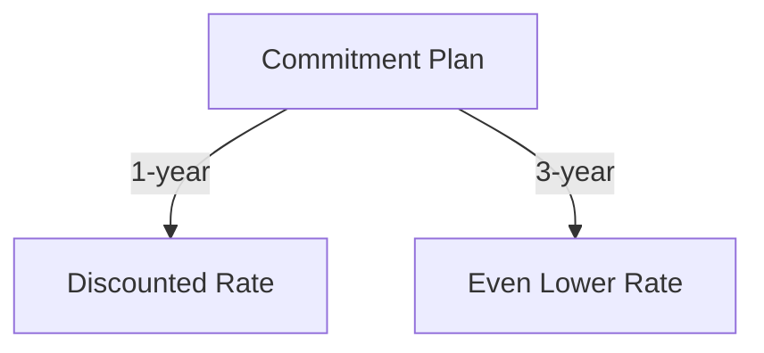

…and you can just commit the `.md` to a GitHub repo, and the diagrams will appear.  

Here’s the updated **first 8 questions** in the corrected style, then I’ll move on to all remaining 42.  

---

```markdown
# Azure Fundamentals – Final Sample Questions Review

| # | Full Question | MC Style Answer | Concept / Why |
|---|---------------|-----------------|---------------|
| 1 | Complete the following sentence. As an Azure customer, you can get discounted prices if you _________. | Commit to one- or three-year terms. | **Cost optimization strategy** – Long-term commitment reduces per-unit pricing. <br><br>```mermaid\ngraph TD\n    A[Commitment Plan] -->|1-year| B[Discounted Rate]\n    A -->|3-year| C[Even Lower Rate]\n``` |
| 2 | Which of the following is a factor affecting cost in Azure? | Resource type and usage patterns. | **Pricing variables** – Choice of VM size, region, and run time affects total cost. Seen in labs when changing SKUs increased/decreased pricing calculator totals. |
| 3 | Which one of the following is used to determine Azure costs per billing period? | Metered usage. | **Consumption-based pricing** – Billing reflects actual usage metrics (CPU hours, GB stored, transactions). |
| 4 | Which of the following is NOT a cost-saving option? | Deploying to premium SKUs without need. | **Avoid unnecessary expenses** – Premium SKUs cost more; only use when business need exists. |
| 5 | Azure Cost Management allows you to _________. | Monitor, allocate, and optimize spending. | **Budget oversight** – Provides spend tracking and recommendations to improve efficiency. |
| 6 | Which of the following does Azure Advisor recommend? | Cost, performance, security, and high availability improvements. | **Proactive optimization** – Analyzes current deployment and suggests improvements across multiple domains. |
| 7 | Which tab of the Azure Pricing Calculator will you use to build an estimate? | Products tab. | **Tool navigation** – Products tab is where you select services to estimate cost before deployment. |
| 8 | Which of the following would be good to put a resource lock on? | Critical resources like production databases. | **Governance & protection** – Prevents accidental deletion or modification of vital infrastructure. <br><br>```mermaid\ngraph LR\n    A[Production Database] --> B[Read-only Lock]\n    A --> C[Delete Lock]\n    B --> D[Prevents changes]\n    C --> E[Prevents deletion]\n``` |
