# Azure Fundamentals – Collapsible Q&A Study Guide (50 Questions)

> **How to use this guide:** Click each question to expand details and view a visual aid. All diagrams are GitHub-safe Mermaid blocks. This doubles as a study guide and a diagramming reference for future projects.

## Diagram Legend (used throughout)
- **flowchart**: General workflows/relationships (`graph TD`/`LR`)
- **sequence**: Request/response or process timelines (`sequenceDiagram`)
- **pie**: Quick composition breakdowns (`pie`)
- **timeline/gantt**: Time-based visuals (`timeline`, `gantt`)
- **er**: Entity relationships (`erDiagram`)
- **state**: Transitions between states (`stateDiagram-v2`)
- **mindmap**: Concept hierarchies (`mindmap`)

---

## Q1. Complete the following sentence: As an Azure customer, Azure Reservations offer discounted prices if you _________.
**Answer (MC style):** Commit to one- or three-year terms.

<details>
<summary>Concept / Why & Visual Aid</summary>

**Concept / Why:**  
Cost optimization for predictable workloads (commit & save).

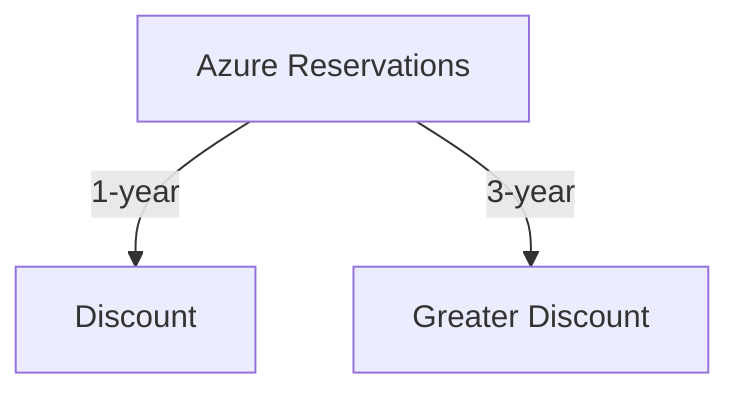
</details>

---

## Q2. Which of the following is a factor affecting costs?
**Answer (MC style):** Resource type and usage patterns.

<details>
<summary>Concept / Why & Visual Aid</summary>

**Concept / Why:**  
Pricing variables like SKU, region, runtime.

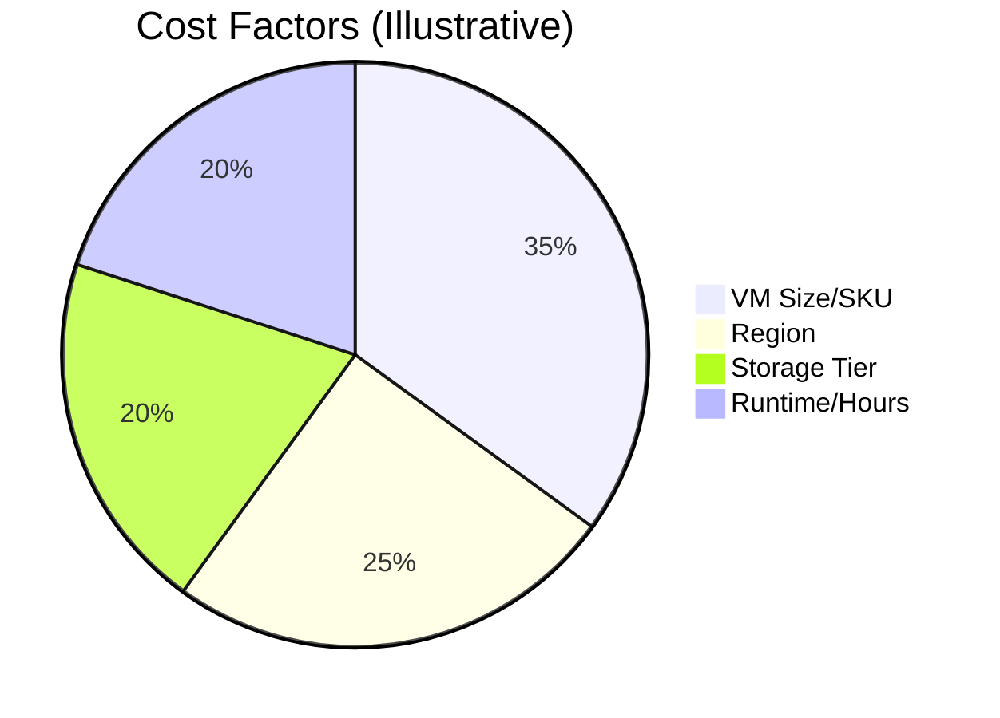
</details>

---

## Q3. Which one of the following is used to determine Azure costs for each billing period?
**Answer (MC style):** Metered usage.

<details>
<summary>Concept / Why & Visual Aid</summary>

**Concept / Why:**  
Consumption-based billing by meters.

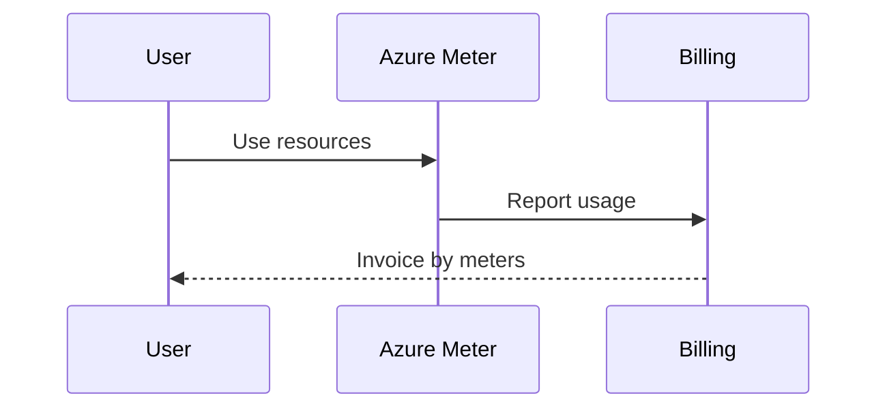
</details>

---

## Q4. Which one of these is not a cost-saving solution?
**Answer (MC style):** Using premium SKUs without need.

<details>
<summary>Concept / Why & Visual Aid</summary>

**Concept / Why:**  
Avoid over-provisioning; match SKU to need.

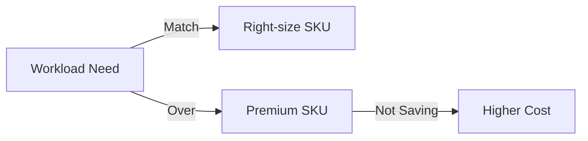
</details>

---

## Q5. Azure Cost Management allows you to _________.
**Answer (MC style):** Monitor, allocate, and optimize spend.

<details>
<summary>Concept / Why & Visual Aid</summary>

**Concept / Why:**  
Budgeting and optimization.

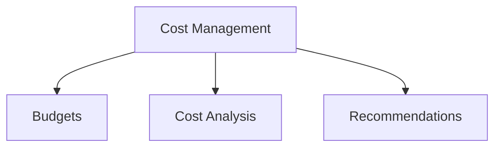
</details>

---

## Q6. Azure Advisor provides recommendations for _________.
**Answer (MC style):** Cost, performance, security, and reliability.

<details>
<summary>Concept / Why & Visual Aid</summary>

**Concept / Why:**  
Proactive best-practice suggestions.

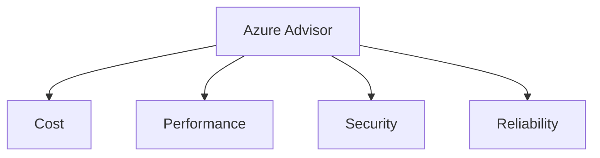
</details>

---

## Q7. Which tab of the Azure Pricing Calculator will you use to put together your estimate?
**Answer (MC style):** Products tab.

<details>
<summary>Concept / Why & Visual Aid</summary>

**Concept / Why:**  
Select services to estimate pricing.

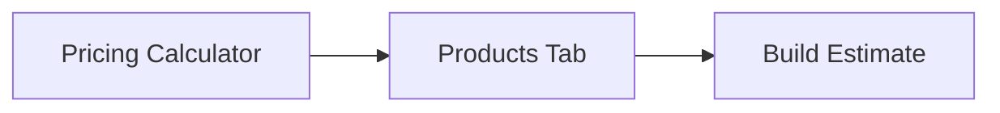
</details>

---

## Q8. Which of the following would be good to put a resource lock on?
**Answer (MC style):** Critical prod resources (e.g., databases).

<details>
<summary>Concept / Why & Visual Aid</summary>

**Concept / Why:**  
Prevent accidental deletion/changes.

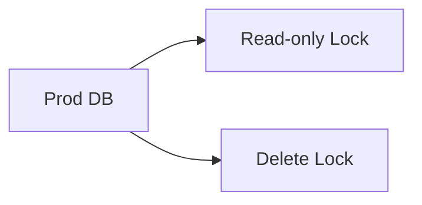
</details>

---

## Q9. Which is the most efficient way to ensure a naming convention is followed across your subscription?
**Answer (MC style):** Azure Policy.

<details>
<summary>Concept / Why & Visual Aid</summary>

**Concept / Why:**  
Governance at scale; audit/deny noncompliance.

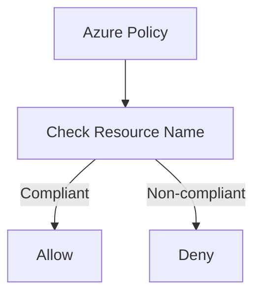
</details>

---

## Q10. Which of the following might be a good usage of tags?
**Answer (MC style):** Track costs by department.

<details>
<summary>Concept / Why & Visual Aid</summary>

**Concept / Why:**  
Metadata for cost allocation/reporting.

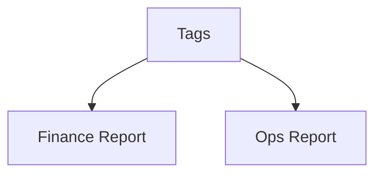
</details>

---

## Q11. Which of the following is not a feature of resource groups?
**Answer (MC style):** Nested resource groups.

<details>
<summary>Concept / Why & Visual Aid</summary>

**Concept / Why:**  
RGs are flat; no nesting.

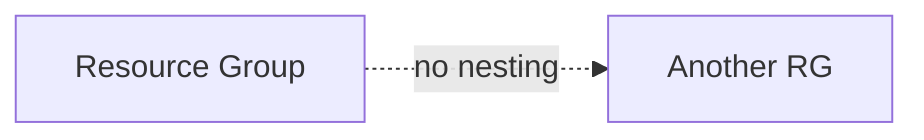
</details>

---

## Q12. Where can you obtain details about the personal data Microsoft processes, how Microsoft processes it, and for what purposes?
**Answer (MC style):** Microsoft Privacy Statement.

<details>
<summary>Concept / Why & Visual Aid</summary>

**Concept / Why:**  
Primary privacy/compliance reference.

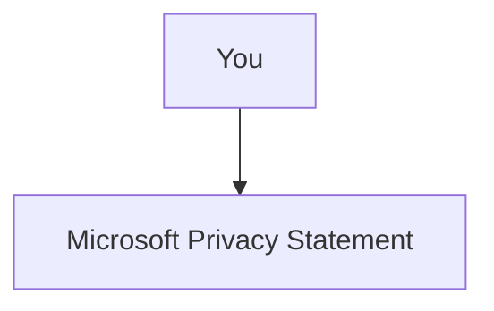
</details>

---

## Q13. Which service provides up-to-date status information about the health of Azure services?
**Answer (MC style):** Azure Service Health.

<details>
<summary>Concept / Why & Visual Aid</summary>

**Concept / Why:**  
Operational awareness: outages/maintenance.

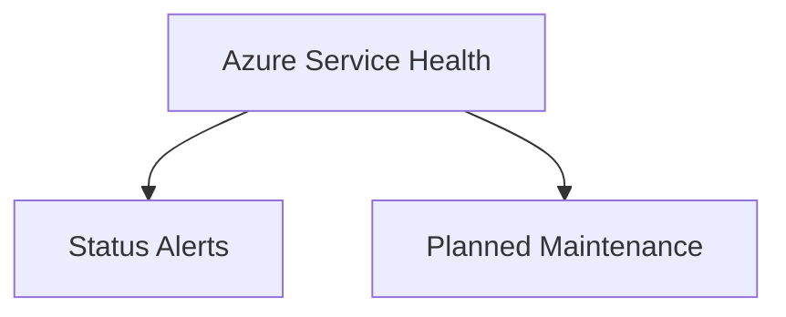
</details>

---

## Q14. Which Azure service allows you to create, assign, and manage policies to enforce different rules and effects over your resources and stay compliant?
**Answer (MC style):** Azure Policy.

<details>
<summary>Concept / Why & Visual Aid</summary>

**Concept / Why:**  
Enforce configuration/compliance at scale.

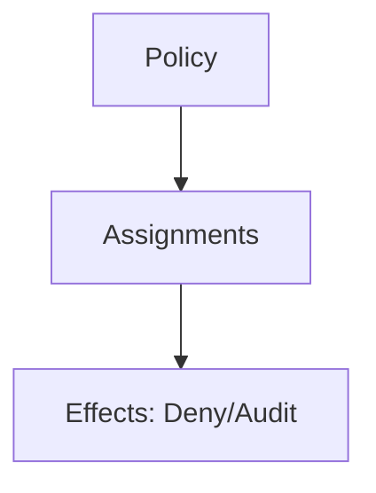
</details>

---

## Q15. Which Azure service allows you to configure fine-grained access management for Azure resources, enabling you to grant users only the rights they need?
**Answer (MC style):** Azure RBAC.

<details>
<summary>Concept / Why & Visual Aid</summary>

**Concept / Why:**  
Least-privilege access control.

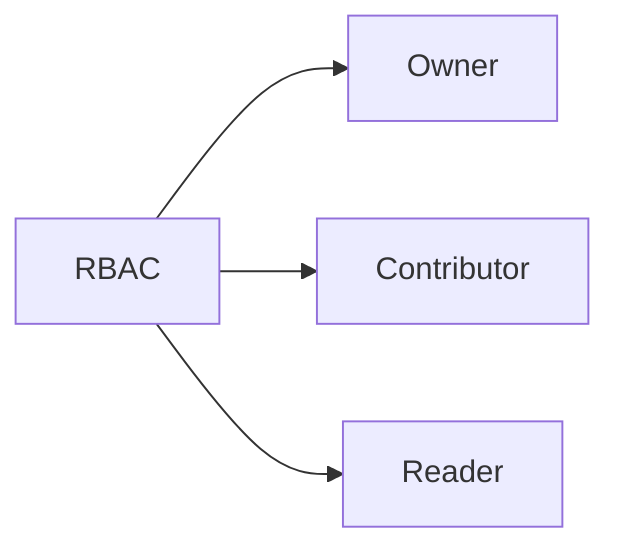
</details>

---

## Q16. You want to store certificates in Azure to centrally manage them for your services. Which Azure service should you use?
**Answer (MC style):** Azure Key Vault.

<details>
<summary>Concept / Why & Visual Aid</summary>

**Concept / Why:**  
Secure storage for keys/secrets/certs.

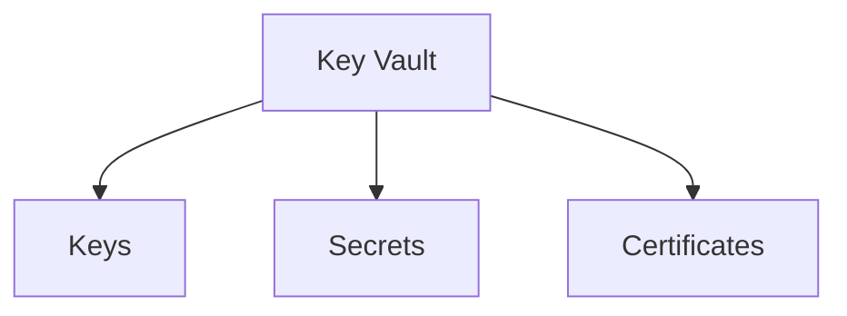
</details>

---

## Q17. Your public-facing website has been overwhelmed and exhausted by an attack and is unavailable. What service should you use to prevent this type of attack?
**Answer (MC style):** Azure DDoS Protection.

<details>
<summary>Concept / Why & Visual Aid</summary>

**Concept / Why:**  
Mitigate volumetric attacks.

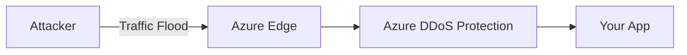
</details>

---

## Q18. Which of these is the strongest way to protect sensitive customer data?
**Answer (MC style):** Encryption at rest & in transit.

<details>
<summary>Concept / Why & Visual Aid</summary>

**Concept / Why:**  
End-to-end data confidentiality.

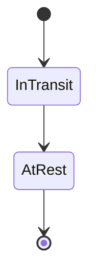
</details>

---

## Q19. Which of these helps you most easily disable an account when an employee leaves your company?
**Answer (MC style):** Azure AD (Entra ID).

<details>
<summary>Concept / Why & Visual Aid</summary>

**Concept / Why:**  
Identity lifecycle management.

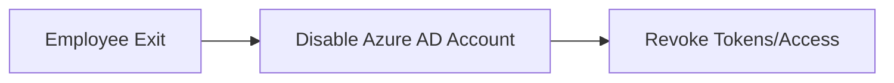
</details>

---

## Q20. Cloud security is a shared responsibility. Which category of cloud services requires the greatest security effort on your part?
**Answer (MC style):** IaaS.

<details>
<summary>Concept / Why & Visual Aid</summary>

**Concept / Why:**  
You manage OS, runtime, apps, data.

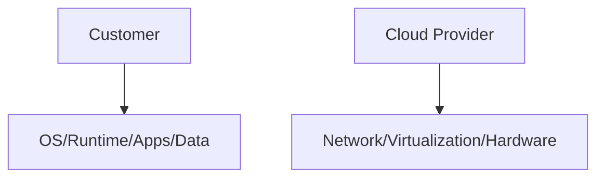
</details>

---

## Q21. How does Azure Traffic Manager reduce latency?
**Answer (MC style):** Routes users to nearest/fastest endpoint.

<details>
<summary>Concept / Why & Visual Aid</summary>

**Concept / Why:**  
Global DNS-based load balancing.

```mermaid
sequenceDiagram
    participant User
    participant DNS as Traffic Manager
    participant SiteA
    participant SiteB
    User->>DNS: Resolve app
    DNS-->>User: Nearest/Fastest endpoint (A or B)
    User->>SiteA: Connect (if chosen)
```
</details>

---

## Q22. What is network latency?
**Answer (MC style):** Delay between request and response.

<details>
<summary>Concept / Why & Visual Aid</summary>

**Concept / Why:**  
Network performance metric (ms).

```mermaid
mindmap
  root((Latency))
    Causes
      Distance
      Congestion
      Routing
    Effects
      Slower Responses
      Timeouts
    Measure
      ms
      Round-trip time
```
</details>

---

## Q23. Which is true about Azure Load Balancer?
**Answer (MC style):** Distributes network traffic across resources.

<details>
<summary>Concept / Why & Visual Aid</summary>

**Concept / Why:**  
High availability within a region.

```mermaid
graph LR
    Client --> LB[Azure Load Balancer]
    LB --> VM1
    LB --> VM2
```
</details>

---

## Q24. Which of the following is true about virtual networks?
**Answer (MC style):** VNets are isolated private networks.

<details>
<summary>Concept / Why & Visual Aid</summary>

**Concept / Why:**  
Segmentation and subnets.

```mermaid
graph TD
    VNet[VNet] --> Sub1[Subnet A]
    VNet --> Sub2[Subnet B]
```
</details>

---

## Q25. What is an Azure region?
**Answer (MC style):** Geographic area with datacenters.

<details>
<summary>Concept / Why & Visual Aid</summary>

**Concept / Why:**  
Placement affects latency & compliance.

```mermaid
graph LR
    User --> Region1[Region A]
    User --> Region2[Region B]
```
</details>

---

## Q26. A celebrity mention causes a huge spike in your mobile app's storage demand. What feature of pay-as-you-go storage is most beneficial?
**Answer (MC style):** Automatic scalability.

<details>
<summary>Concept / Why & Visual Aid</summary>

**Concept / Why:**  
Elastic capacity without manual provisioning.

```mermaid
graph TD
    Demand[Demand Spike] --> Scale[Auto-Scale Storage]
    Scale --> Serve[Continue Serving]
```
</details>

---

## Q27. Which situation would yield the most benefits from relocating an on-premises data store to Azure?
**Answer (MC style):** Reduce capital expense & gain scalability.

<details>
<summary>Concept / Why & Visual Aid</summary>

**Concept / Why:**  
CapEx→OpEx, scale on demand.

```mermaid
timeline
    title CapEx to OpEx Shift
    2019 : Buy hardware (CapEx)
    2022 : Migrate to Azure (OpEx)
    2025 : Scale with demand
```
</details>

---

## Q28. Suppose you work at a startup with limited funding. Why prefer Azure data storage over on-premises?
**Answer (MC style):** Pay-as-you-go lowers upfront cost.

<details>
<summary>Concept / Why & Visual Aid</summary>

**Concept / Why:**  
Cash flow friendly; scale as needed.

```mermaid
pie
    title Startup Cost Considerations
    "Upfront CapEx" : 15
    "OpEx Flexibility" : 85
```
</details>

---

## Q29. Compute options give different control levels. Which list orders them from most control to least?
**Answer (MC style):** VMs → Containers → App Services.

<details>
<summary>Concept / Why & Visual Aid</summary>

**Concept / Why:**  
Control vs abstraction trade-off.

```mermaid
graph LR
    VMs -- most control --> Containers -- less --> AppServices -- least --> SaaS
```
</details>

---

## Q30. Photo-sharing app with unpredictable spikes: which Azure compute resource fits best?
**Answer (MC style):** Serverless / Azure Functions.

<details>
<summary>Concept / Why & Visual Aid</summary>

**Concept / Why:**  
Event-driven scaling; pay per execution.

```mermaid
sequenceDiagram
    participant User
    participant Func as Azure Functions
    participant Store as Storage
    User->>Func: Upload Photo (event)
    Func->>Store: Process/Save
    loop Spikes
      User->>Func: Burst of uploads
    end
```
</details>

---

## Q31. Existing app running locally needs additional capacity and you prefer Azure over buying hardware. Which compute option is quickest to run in Azure?
**Answer (MC style):** IaaS VM lift-and-shift.

<details>
<summary>Concept / Why & Visual Aid</summary>

**Concept / Why:**  
Fastest path; minimal refactor.

```mermaid
graph TD
    OnPrem[On-Prem App] --> Lift[Create VM in Azure]
    Lift --> Run[Run App in VM]
```
</details>

---

## Q32. Azure Advisor provides advice on which topics:
**Answer (MC style):** Cost, performance, security, reliability.

<details>
<summary>Concept / Why & Visual Aid</summary>

**Concept / Why:**  
Holistic recommendations.

```mermaid
graph TD
    Advisor --> Cost
    Advisor --> Performance
    Advisor --> Security
    Advisor --> Reliability
```
</details>

---

## Q33. An Azure dashboard is stored as which type of file?
**Answer (MC style):** JSON.

<details>
<summary>Concept / Why & Visual Aid</summary>

**Concept / Why:**  
Export/import dashboard definitions.

```mermaid
graph LR
    Dashboard --> JSON[JSON File]
    JSON --> Import[Import/Export]
```
</details>

---

## Q34. Billing in Azure is ______________
**Answer (MC style):** Pay-as-you-go by usage.

<details>
<summary>Concept / Why & Visual Aid</summary>

**Concept / Why:**  
Consumption billing.

```mermaid
graph TD
    Use[Use Resources] --> Meter[Meters]
    Meter --> Bill[Bill by Usage]
```
</details>

---

## Q35. Which of the following defines an Azure subscription correctly?
**Answer (MC style):** Billing-tied logical resource container.

<details>
<summary>Concept / Why & Visual Aid</summary>

**Concept / Why:**  
Scope for policies and RBAC.

```mermaid
erDiagram
    SUBSCRIPTION ||--o{ RESOURCE : contains
    SUBSCRIPTION {
      string Id
      string BillingAccount
    }
    RESOURCE {
      string Name
      string Type
    }
```
</details>

---

## Q36. Application availability refers to what?
**Answer (MC style):** Percentage of time it’s operational.

<details>
<summary>Concept / Why & Visual Aid</summary>

**Concept / Why:**  
Reliability/SLA metric.

```mermaid
gantt
    title Availability Over Time
    dateFormat  YYYY-MM-DD
    section Uptime
    Service Running         :done,    des1, 2025-01-01, 2025-01-31
    Maintenance Window      :active,  des2, 2025-02-01, 2025-02-02
    Service Running         :done,    des3, 2025-02-03, 2025-02-28
```
</details>

---

## Q37. To use Azure datacenters with independent power, cooling, and networking within a region, choose _________?
**Answer (MC style):** Availability Zones.

<details>
<summary>Concept / Why & Visual Aid</summary>

**Concept / Why:**  
Fault domain isolation for resilience.

```mermaid
graph TD
    Region[Azure Region] --> Zone1[AZ-1]
    Region --> Zone2[AZ-2]
    Region --> Zone3[AZ-3]
```
</details>

---

## Q38. Deploying an app can be done directly to what level of physical granularity?
**Answer (MC style):** VM or App Service Plan.

<details>
<summary>Concept / Why & Visual Aid</summary>

**Concept / Why:**  
Target runtime environment.

```mermaid
graph LR
    Code --> VM
    Code --> AppServicePlan
```
</details>

---

## Q39. When should you scale out your deployment?
**Answer (MC style):** High load requires more instances.

<details>
<summary>Concept / Why & Visual Aid</summary>

**Concept / Why:**  
Horizontal scaling.

```mermaid
graph TD
    Low[Low Load] --> One[1 Instance]
    High[High Load] --> Many[Multiple Instances]
```
</details>

---

## Q40. What does Remote Desktop Services allow you to do?
**Answer (MC style):** Remote access to desktops/apps.

<details>
<summary>Concept / Why & Visual Aid</summary>

**Concept / Why:**  
VDI/thin client model.

```mermaid
sequenceDiagram
    participant User
    participant RDS as RDS Host
    participant App
    User->>RDS: RDP Session
    RDS->>App: Execute App
    App-->>User: UI Stream
```
</details>

---

## Q41. You're developing an application and want to focus on building, testing, and deploying without managing underlying hardware/software. Which cloud service type is best?
**Answer (MC style):** PaaS.

<details>
<summary>Concept / Why & Visual Aid</summary>

**Concept / Why:**  
Provider manages infra; you ship code.

```mermaid
graph TD
    Dev[Developer] --> Code[Code & Deploy]
    Cloud[PaaS] --> Infra[Infra Managed by Provider]
```
</details>

---

## Q42. Suppose you have legacy apps requiring specialized mainframe hardware and newer apps on commodity hardware. Which cloud deployment model is best?
**Answer (MC style):** Hybrid cloud.

<details>
<summary>Concept / Why & Visual Aid</summary>

**Concept / Why:**  
Mix on-prem and public cloud.

```mermaid
graph LR
    Legacy[On-Prem Mainframe] --- Hybrid --- Modern[Public Cloud Apps]
```
</details>

---

## Q43. Which terms below are benefits of using cloud services?
**Answer (MC style):** Scalability, elasticity, pay-as-you-go.

<details>
<summary>Concept / Why & Visual Aid</summary>

**Concept / Why:**  
Core cloud value props.

```mermaid
mindmap
  root((Cloud Benefits))
    Scalability
    Elasticity
    Pay-as-you-go
    Global Reach
    Reliability
```
</details>

---

## Q44. True or false: Azure has money-saving options for test and development servers.
**Answer (MC style):** True.

<details>
<summary>Concept / Why & Visual Aid</summary>

**Concept / Why:**  
Dev/Test offers & reserved capacity.

```mermaid
graph TD
    DevTest[Dev/Test] --> Discounts[Discounted Rates]
```
</details>

---

## Q45. True or false: If you already have Windows Server licenses, you have to pay for them again on Azure.
**Answer (MC style):** False (Azure Hybrid Benefit).

<details>
<summary>Concept / Why & Visual Aid</summary>

**Concept / Why:**  
License mobility to Azure.

```mermaid
graph LR
    OnPremLic[On-Prem License] --> AHB[Azure Hybrid Benefit]
    AHB --> AzureVM[Azure VM Cost ↓]
```
</details>

---

## Q46. True or false: PaaS is generally less expensive than IaaS.
**Answer (MC style):** True (generally).

<details>
<summary>Concept / Why & Visual Aid</summary>

**Concept / Why:**  
Less ops overhead vs VMs.

```mermaid
pie
    title Cost Share (Illustrative)
    "IaaS Ops Effort" : 65
    "PaaS Ops Effort" : 35
```
</details>

---

## Q47. True or false: You can share your estimate through an Excel spreadsheet or through a URL.
**Answer (MC style):** True.

<details>
<summary>Concept / Why & Visual Aid</summary>

**Concept / Why:**  
Pricing calculator supports sharing.

```mermaid
graph TD
    Calc[Pricing Calculator] --> Excel[Export to Excel]
    Calc --> Link[Share URL]
```
</details>

---

## Q48. Tags applied at a resource group level are propagated to resources within the resource group.
**Answer (MC style):** False.

<details>
<summary>Concept / Why & Visual Aid</summary>

**Concept / Why:**  
No automatic inheritance.

```mermaid
graph TD
    RG[Resource Group Tags] -.X.-> Res[Resource]
```
</details>

---

## Q49. Tags can be applied to any type of resource on Azure.
**Answer (MC style):** True.

<details>
<summary>Concept / Why & Visual Aid</summary>

**Concept / Why:**  
Broad tagging support.

```mermaid
graph TD
    Tag[Tag] --> VM
    Tag --> Storage
    Tag --> VNet
    Tag --> App
```
</details>

---

## Q50. True or false: You can download published audit reports and other compliance-related information from the Service Trust Portal.
**Answer (MC style):** True.

<details>
<summary>Concept / Why & Visual Aid</summary>

**Concept / Why:**  
Compliance transparency & docs.

```mermaid
graph LR
    STP[Service Trust Portal] --> Reports[Audit/Compliance Reports]
    Reports --> You
```
</details>

---
